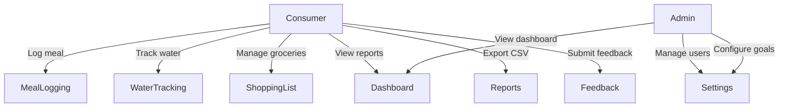
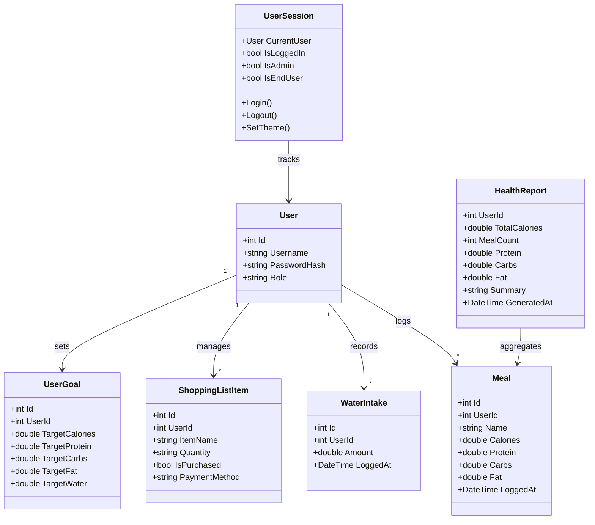
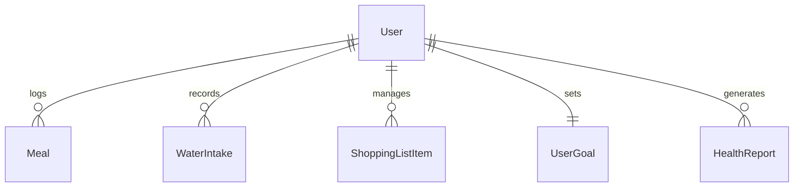

# PUSL2021 Computing Group Project — Interim Report

**Project Title**: SmartBite — A Blazor-Based Health Companion

**Module**: PUSL2021 Computing Group Project

**Submission Type**: Interim Report

---

## Table of Contents

- [Chapter 01 — Introduction](#chapter-01--introduction)
  - [1.1 Introduction](#11-introduction)
  - [1.2 Problem Definition](#12-problem-definition)
  - [1.3 Project Objectives](#13-project-objectives)
- [Chapter 02 — System Analysis](#chapter-02--system-analysis)
  - [2.1 Facts Gathering Techniques](#21-facts-gathering-techniques)
  - [2.2 Existing System](#22-existing-system)
  - [2.3 Drawbacks of the Existing System](#23-drawbacks-of-the-existing-system)
- [Chapter 03 — Requirements Specification](#chapter-03--requirements-specification)
  - [3.1 Functional Requirements](#31-functional-requirements)
  - [3.2 Non-Functional Requirements](#32-non-functional-requirements)
  - [3.3 Hardware / Software Requirements](#33-hardware--software-requirements)
- [Chapter 04 — Feasibility Study](#chapter-04--feasibility-study)
  - [4.1 Operational Feasibility](#41-operational-feasibility)
  - [4.2 Technical Feasibility](#42-technical-feasibility)
  - [4.3 Economical Feasibility](#43-economical-feasibility)
- [Chapter 05 — System Architecture](#chapter-05--system-architecture)
  - [5.1 Use Case Diagram](#51-use-case-diagram)
  - [5.2 Class Diagram of Proposed System](#52-class-diagram-of-proposed-system)
  - [5.3 ER Diagram](#53-er-diagram)
  - [5.4 High-Level Architectural Diagram](#54-high-level-architectural-diagram)
- [Chapter 06 — Development Tools and Technologies](#chapter-06--development-tools-and-technologies)
  - [6.1 Development Methodology](#61-development-methodology)
  - [6.2 Programming Languages and Tools](#62-programming-languages-and-tools)
  - [6.3 Third-Party Components and Libraries](#63-third-party-components-and-libraries)
  - [6.4 Algorithms](#64-algorithms)
- [Chapter 07 — Implementation Progress](#chapter-07--implementation-progress)
  - [7.1 Development Environment Setup](#71-development-environment-setup)
  - [7.2 Implemented Features](#72-implemented-features)
  - [7.3 Screenshots / Code Snippets](#73-screenshots--code-snippets)
  - [7.4 Challenges Encountered and Solutions](#74-challenges-encountered-and-solutions)
  - [7.5 Current System Limitations](#75-current-system-limitations)
- [Chapter 08 — Discussion](#chapter-08--discussion)
- [References](#references)
- [Team Plan & Responsibility Matrix](#team-plan--responsibility-matrix)
- [Appendixes](#appendixes)

---

## List of Figures and Tables

| # | Type | Title | Section |
|---|------|-------|---------|
| Figure 5.1 | Diagram | Use Case Diagram | 5.1 |
| Figure 5.2 | Diagram | Class Diagram of Proposed System | 5.2 |
| Figure 5.3 | Diagram | ER Diagram | 5.3 |
| Figure 5.4 | Diagram | High-Level Architectural Diagram | 5.4 |
| Figure 7.1 | Screenshot | Application Startup | 7.3 |
| Figure 7.2 | Screenshot | Dashboard View | 7.3 |
| Figure 7.3 | Screenshot | Home Page | 7.3 |
| Figure 7.4 | Screenshot | Log History | 7.3 |
| Figure 7.5 | Screenshot | Performance Reports | 7.3 |
| Figure 7.6 | Screenshot | Hydration Tracking | 7.3 |
| Figure 7.7 | Screenshot | Groceries / Shopping List | 7.3 |
| Figure 7.8 | Screenshot | Settings — Admin Access | 7.3 |
| Figure 7.9 | Screenshot | Settings — Consumer Blocked | 7.3 |
| Figure 7.10 | Screenshot | Support / Feedback | 7.3 |
| Figure 7.11 | Screenshot | Labs (Beta) | 7.3 |
| Figure 7.12 | Screenshot | Connection / Rejoin Error | 7.3 |
| Figure 7.13 | Screenshot | Role-Based Access Warning | 7.3 |
| Table 3.1 | Table | Functional Requirements | 3.1 |
| Table 3.2 | Table | Non-Functional Requirements | 3.2 |
| Table 3.3 | Table | Software Requirements | 3.3 |
| Table 6.1 | Table | Programming Languages and Tools | 6.2 |
| Table 6.2 | Table | Third-Party Components and Libraries | 6.3 |
| Table 7.1 | Table | Implemented Features Status | 7.2 |
| Table 7.2 | Table | Challenges and Solutions | 7.4 |
| Table 8.1 | Table | Team Responsibility Matrix | Team Plan |

---

## Chapter 01 — Introduction

### 1.1 Introduction

SmartBite is a web-based health companion application built using Blazor Server on .NET 10. It provides end users with tools to log meals, track water intake, manage grocery shopping lists, and view health performance reports. The system implements role-based access control, separating functionality between consumers (end users) and administrators. The user interface follows a modern design language inspired by Windows 11 mica and acrylic material effects, with full light/dark theme support.

The project is structured as a multi-project .NET solution consisting of four projects:

- **computer_project.Web** — the Blazor Server front-end containing all UI components, routing, session management, and API client logic.
- **computer_project.ApiService** — the ASP.NET Core back-end exposing RESTful minimal API endpoints for data access.
- **computer_project.ServiceDefaults** — shared service configuration and wiring used across projects.
- **computer_project.AppHost** — the host/bootstrap entry point for the solution.

### 1.2 Problem Definition

Health-conscious individuals often rely on multiple disconnected tools to manage their nutrition — one app for meal tracking, another for water intake, a separate note for grocery lists, and manual calculations for macro targets. This fragmentation leads to:

- Inconsistent data entry across platforms.
- No unified view of daily nutritional progress.
- Difficulty correlating grocery purchases with meal plans.
- No role separation for household or team-based health management.

There is a need for a single, unified platform that consolidates meal logging, water tracking, grocery management, and health reporting under one interface with role-aware access.

### 1.3 Project Objectives

1. Develop a unified web application that combines meal logging, water tracking, grocery list management, and health reporting.
2. Implement role-based access control with distinct experiences for consumers (health tracking) and administrators (user/system management).
3. Deliver a responsive, theme-aware UI that works across desktop and mobile browsers.
4. Provide data export capabilities (CSV) for personal health data portability.
5. Build a modular architecture that separates front-end, back-end, and shared concerns into distinct projects.
6. Design the system for future extensibility, including AI-powered nutrition estimates and persistent database storage.

---

## Chapter 02 — System Analysis

### 2.1 Facts Gathering Techniques

The following techniques were used to gather requirements and understand user needs:

- **Observation**: Reviewed existing health tracking applications (MyFitnessPal, Fitbit, Samsung Health) to identify common features and UX patterns.
- **Questionnaires**: Informal surveys among team members and peers to identify pain points with current health tracking tools.
- **Document review**: Analysed nutritional guidelines and macro tracking best practices to determine the data fields and calculations required.
- **Prototyping**: Iterative UI prototypes were built in Blazor to validate layout decisions and navigation flows before full implementation.

### 2.2 Existing System

Before SmartBite, users relied on a combination of:

- **Paper-based tracking**: Notebooks or printed meal plans with manual calorie calculations.
- **Spreadsheets**: Excel/Google Sheets for logging meals and water, requiring manual formula setup.
- **Multiple apps**: Separate mobile applications for meal logging (e.g. MyFitnessPal), water tracking (e.g. WaterMinder), and grocery lists (e.g. AnyList).

### 2.3 Drawbacks of the Existing System

| Drawback | Impact |
|----------|--------|
| Data fragmentation across multiple tools | Users cannot see a unified daily health summary |
| No role-based access | No distinction between personal tracking and admin/management needs |
| Manual calculations | Error-prone macro aggregation and target tracking |
| No integrated grocery-to-meal correlation | Shopping lists are disconnected from nutritional goals |
| Platform dependency | Most apps are mobile-only; no desktop web experience |
| No export capability | Difficult to share or back up personal health data |

---

## Chapter 03 — Requirements Specification

### 3.1 Functional Requirements

*Table 3.1 — Functional Requirements*

| ID | Requirement | Priority |
|----|-------------|----------|
| FR-01 | Users shall be able to register and log in with a username and password | High |
| FR-02 | Users shall be able to log meals with name, calories, protein, carbs, and fat | High |
| FR-03 | Users shall be able to view meal history sorted by date | High |
| FR-04 | Users shall be able to log water intake amounts | High |
| FR-05 | Users shall be able to view a dashboard with daily macro summary cards | High |
| FR-06 | Users shall be able to export health reports as CSV files | Medium |
| FR-07 | Users shall be able to add, edit, delete, and mark grocery items as purchased | High |
| FR-08 | Users shall be able to assign payment methods to grocery items | Medium |
| FR-09 | The system shall simulate a checkout/delivery tracker for grocery orders | Low |
| FR-10 | Admins shall be able to view and manage all registered users | High |
| FR-11 | Admins shall have exclusive access to the Settings page | High |
| FR-12 | Consumers shall be blocked from accessing admin-only pages | High |
| FR-13 | Users shall be able to toggle between light and dark themes | Medium |
| FR-14 | Users shall be able to submit feedback via a contact/support page | Medium |
| FR-15 | The system shall display a macro aggregation report (total calories, protein, carbs, fat) | High |

### 3.2 Non-Functional Requirements

*Table 3.2 — Non-Functional Requirements*

| ID | Requirement | Category |
|----|-------------|----------|
| NFR-01 | The UI shall be responsive and usable on screens from 320px to 1920px+ | Usability |
| NFR-02 | Page navigation shall feel instant via Blazor Server SignalR connection | Performance |
| NFR-03 | The application shall follow a consistent mica/acrylic visual theme | Usability |
| NFR-04 | The system shall handle SignalR disconnections gracefully with a reload prompt | Reliability |
| NFR-05 | Role-based access shall be enforced at the component rendering level | Security |
| NFR-06 | The codebase shall be organised into separate projects for UI, API, and shared defaults | Maintainability |
| NFR-07 | The system shall seed demo data on startup so it is usable without manual setup | Usability |

### 3.3 Hardware / Software Requirements

*Table 3.3 — Software Requirements*

| Component | Requirement |
|-----------|-------------|
| Runtime | .NET 10 SDK (mandatory) |
| IDE | Visual Studio 2026 Insiders (recommended) or any editor with .NET CLI |
| OS | Windows 10/11, macOS, or Linux (any OS supporting .NET 10) |
| Browser | Any modern browser (Chrome, Edge, Firefox, Safari) |
| Source control | Git 2.x+ |
| Network | Internet connection required for initial package restore; SignalR requires active connection during use |

**Hardware** (minimum):
- 4 GB RAM
- 2 GHz dual-core processor
- 2 GB free disk space

---

## Chapter 04 — Feasibility Study

### 4.1 Operational Feasibility

- Target users (health-conscious individuals) are already familiar with web-based dashboards and mobile-responsive layouts, reducing the learning curve.
- The role separation (admin vs consumer) maps directly to real-world access needs — admins manage users and settings while consumers track their personal health data.
- Minimal training is required as the UI follows familiar patterns: sidebar navigation, card-based dashboards, and standard form inputs.
- The system seeds demo data on startup, making it immediately usable for evaluation without manual data entry.

### 4.2 Technical Feasibility

- Built on .NET 10 with Blazor Server — a mature, well-documented stack with strong tooling support (Visual Studio, dotnet CLI, hot reload).
- Entity Framework Core with an in-memory database provider enables rapid prototyping; the architecture is designed to swap to SQL Server or PostgreSQL without code changes to the business logic.
- JS interop via `IJSRuntime` handles browser-specific operations (theme persistence via `data-bs-theme`, CSV file downloads) where Blazor alone is insufficient.
- The project structure follows .NET Aspire conventions with shared `ServiceDefaults`, making it straightforward to scale or deploy to cloud infrastructure in the future.

### 4.3 Economical Feasibility

- All core tools used are free and open-source: .NET 10 SDK, Bootstrap 5, Entity Framework Core, and Bootstrap Icons.
- No paid cloud services are required for development — the application runs locally on any machine with the .NET 10 runtime.
- Google Gemini API (planned for AI features) offers a free tier sufficient for development and low-traffic demos; however, this integration was attempted and did not work during this phase, so no cost was incurred.
- The total development cost is limited to team members' time, with zero licensing or infrastructure expenses during the development phase.

---

## Chapter 05 — System Architecture

### 5.1 Use Case Diagram

*Figure 5.1 — Use Case Diagram*



### 5.2 Class Diagram of Proposed System

*Figure 5.2 — Class Diagram*



### 5.3 ER Diagram

*Figure 5.3 — Entity-Relationship Diagram*



### 5.4 High-Level Architectural Diagram

*Figure 5.4 — High-Level Architecture*

```
┌──────────────────────────────────────────────────────┐
│                      Browser                         │
│  ┌────────────────────────────────────────────────┐  │
│  │  Blazor Server (SignalR)                       │  │
│  │  MainLayout · NavMenu · Pages                  │  │
│  │  UserSession · IJSRuntime interop              │  │
│  └──────────────────┬─────────────────────────────┘  │
└─────────────────────┼────────────────────────────────┘
                      │ HTTP (SmartBiteApiClient)
┌─────────────────────┼────────────────────────────────┐
│  computer_project.ApiService                         │
│  ┌──────────────────┴─────────────────────────────┐  │
│  │  ASP.NET Core Minimal APIs                     │  │
│  │  /meals · /water · /shoppinglist               │  │
│  │  /stats · /goals · /users · /login             │  │
│  └──────────────────┬─────────────────────────────┘  │
│                     │                                │
│  ┌──────────────────┴─────────────────────────────┐  │
│  │  Entity Framework Core (InMemory Database)     │  │
│  │  AppDbContext                                   │  │
│  │  DbSet: Users, Meals, WaterIntakes,            │  │
│  │         ShoppingListItems, UserGoals,           │  │
│  │         HealthReports                           │  │
│  └────────────────────────────────────────────────┘  │
└──────────────────────────────────────────────────────┘

┌──────────────────────────────────────────────────────┐
│  computer_project.ServiceDefaults                    │
│  Shared service wiring and extension methods         │
└──────────────────────────────────────────────────────┘

┌──────────────────────────────────────────────────────┐
│  computer_project.AppHost                            │
│  Solution bootstrap and hosting configuration        │
└──────────────────────────────────────────────────────┘
```

---

## Chapter 06 — Development Tools and Technologies

### 6.1 Development Methodology

The project follows an **iterative and incremental** development methodology:

- Features are developed in **vertical slices** — each slice includes the model, API endpoint, client method, and UI component for a single feature.
- **Source control** is managed via Git on GitHub (`master` branch with feature-based commits).
- **Peer review** is conducted informally within the team before merging changes.
- **Prototyping** is used extensively — the in-memory database allows rapid testing without migration overhead.

### 6.2 Programming Languages and Tools

*Table 6.1 — Programming Languages and Tools*

| Tool / Language | Purpose |
|-----------------|---------|
| C# 14 / .NET 10 | Backend API logic and Blazor UI component code |
| Razor (`.razor`) | Component markup, templating, and rendering |
| HTML / CSS | Layout structure, styling, mica/acrylic visual effects |
| JavaScript | Theme toggle (`setTheme`) and CSV file download via `IJSRuntime` |
| PowerShell / dotnet CLI | Build (`dotnet restore`), run (`dotnet run`), hot reload (`dotnet watch`) |
| Visual Studio 2026 Insiders | Primary integrated development environment |
| Git + GitHub | Version control, collaboration, and repository hosting |

### 6.3 Third-Party Components and Libraries

*Table 6.2 — Third-Party Components and Libraries*

| Library | Role |
|---------|------|
| Bootstrap 5 | Responsive grid system, buttons, cards, dropdowns, modals |
| Bootstrap Icons | SVG icon set (`bi bi-*`) used across all UI components |
| Entity Framework Core (InMemory provider) | ORM and data access layer for demo-phase persistence |
| .NET Aspire (`ServiceDefaults`) | Shared service wiring, default configurations, and health checks |

### 6.4 Algorithms

The following algorithms and logic patterns are used in the system:

1. **Macro aggregation** — Server-side LINQ queries sum calories, protein, carbs, and fat across all logged meals to produce the `HealthReport` model. This runs on every request to the `/stats` endpoint.

2. **Checkout tracker simulation** — A client-side stepped progress algorithm runs 10 stages with timed delays (`Task.Delay`). Each stage injects a status log message, updates a progress percentage, and on completion automatically marks all unpurchased items as purchased via API calls.

3. **Role-based rendering** — The `UserSession` service exposes `IsAdmin` and `IsEndUser` boolean flags derived from `CurrentUser.Role`. Razor components use `@if` directives to conditionally render UI blocks. The `<ConsumerOnly>` wrapper component centralises this pattern for reuse across pages.

4. **CSV export** — A `StringBuilder` constructs CSV content row-by-row from meal data and report summaries. The resulting string is passed to a JavaScript function via `IJSRuntime` that triggers a browser file download.

---

## Chapter 07 — Implementation Progress

### 7.1 Development Environment Setup

1. **Install .NET 10 SDK** — required; earlier versions are not supported.
2. **Clone the repository**:
   ```bash
   git clone https://github.com/ZeroTrace0245/computer_project.git
   cd computer_project
   ```
3. **Restore dependencies**:
   ```bash
   dotnet restore
   ```
4. **Run the API**:
   ```bash
   dotnet run --project computer_project.ApiService
   ```
5. **Run the UI** (with hot reload):
   ```bash
   dotnet watch --project computer_project.Web
   ```

The application seeds demo data (users, meals, water intakes, shopping items, and goals) automatically on first launch.

### 7.2 Implemented Features

*Table 7.1 — Implemented Features Status*

| Feature | Status | Details |
|---------|--------|---------|
| User registration and login | ✅ Done | Simple credential flow (demo, no password hashing) |
| Meal logging | ✅ Done | Add meals with name, calories, protein, carbs, fat; view history |
| Dashboard and reports | ✅ Done | Daily macro summary cards, health tips, CSV export |
| Water tracking | ✅ Done | Log water intakes, view intake history |
| Shopping list | ✅ Done | Add/delete items, payment method tagging, toggle purchased state |
| Checkout tracker | ✅ Done | Simulated delivery progress with live status logs |
| Role-based access control | ✅ Done | Admin-only Settings page; consumers blocked via `<ConsumerOnly>` |
| Light/dark theme toggle | ✅ Done | JS interop sets `data-bs-theme`; mica/acrylic effects adapt |
| Feedback/support page | ✅ Done | Contact channels (phone, WhatsApp, X, Facebook) and rating form |
| Responsive layout | ✅ Done | Collapsible sidebar on mobile, sticky header, adaptive grid |

### 7.3 Screenshots / Code Snippets

#### Screenshots

*Figure 7.1 — Application Startup*


*Figure 7.2 — Dashboard View*


*Figure 7.3 — Home Page*


*Figure 7.4 — Log History*


*Figure 7.5 — Performance Reports*


*Figure 7.6 — Hydration Tracking*


*Figure 7.7 — Groceries / Shopping List*


*Figure 7.8 — Settings (Admin Access)*


*Figure 7.9 — Settings (Consumer Blocked)*


*Figure 7.10 — Support / Feedback*


*Figure 7.11 — Labs (Beta)*


*Figure 7.12 — Connection / Rejoin Error*


*Figure 7.13 — Role-Based Access Warning*


#### Key Code Snippets

**Role-based gate component** (`ConsumerOnly.razor`):
```razor
@if (Session.IsAdmin)
{
    <div class="container py-5 text-center">
        <h2 class="fw-bold">Consumer Access Only</h2>
        <p>This feature is designed for consumers.</p>
        <a href="settings" class="btn btn-primary">User & System Management</a>
    </div>
}
else
{
    @ChildContent
}

@code {
    [Parameter] public RenderFragment? ChildContent { get; set; }
}
```

**Session state management** (`UserSession.cs`):
```csharp
public class UserSession
{
    public User? CurrentUser { get; private set; }
    public bool IsLoggedIn => CurrentUser != null;
    public bool IsAdmin => CurrentUser?.Role == "Admin";
    public bool IsEndUser => CurrentUser?.Role == "EndUser";

    public event Action? OnChange;

    public void Login(User user) { CurrentUser = user; NotifyStateChanged(); }
    public void Logout() { CurrentUser = null; NotifyStateChanged(); }
    public void NotifyStateChanged() => OnChange?.Invoke();
}
```

**CSV export** (`Reports.razor`):
```csharp
private async Task ExtractCSV()
{
    var csv = new StringBuilder();
    csv.AppendLine("Type,Name,Calories,Protein,Carbs,Fat,Date");
    csv.AppendLine($"Summary,Daily Total,{report.TotalCalories},...");
    foreach (var meal in meals)
    {
        csv.AppendLine($"Meal,{meal.Name},{meal.Calories},...");
    }
    await JS.InvokeVoidAsync("downloadFile", filename, csv.ToString());
}
```

### 7.4 Challenges Encountered and Solutions

*Table 7.2 — Challenges and Solutions*

| # | Challenge | Solution |
|---|-----------|----------|
| 1 | Blazor Server loses SignalR connection on idle or network drop | Added a reconnection error UI (`blazor-error-ui` div) with a user-facing reload prompt at the bottom of the layout |
| 2 | Google Gemini AI API key integration was attempted but did not work | AI features (nutrition estimates, recommendations, chat) were moved to future plans; the `AIService` class remains in the codebase for future re-enablement |
| 3 | Role-based access checks were scattered and duplicated across multiple pages | Centralised role logic in `UserSession` (`IsAdmin`, `IsEndUser` properties) and created a reusable `<ConsumerOnly>` wrapper component |
| 4 | Theme selection did not persist across page navigations | `ApplyTheme()` is called via `OnAfterRenderAsync` on the first render; JS interop sets the `data-bs-theme` attribute on the HTML element |
| 5 | In-memory database resets all data on every application restart | Seed data is added in both `Program.cs` (runtime seeding) and `OnModelCreating` (EF model seeding) so the app is always usable after launch |

### 7.5 Current System Limitations

1. **No persistent storage** — All data lives in an Entity Framework Core in-memory database. Data is lost on every application restart.
2. **No real authentication** — Passwords are stored and compared in plain text. There is no token-based, cookie-based, or hashed credential flow.
3. **Single-user demo scope** — Most API endpoints default to `UserId = 1`. There is no multi-user session isolation or per-user data scoping.
4. **No automated tests** — The solution contains no unit test or integration test projects.
5. **No AI features** — The Google Gemini API key was configured but did not function. AI-powered nutrition estimates and meal recommendations are not operational.
6. **No offline support** — Blazor Server requires a live SignalR connection. There is no service worker, PWA manifest, or offline fallback.

---

## Chapter 08 — Discussion

### Summary of the Report

This report presents SmartBite, a Blazor Server web application that consolidates meal logging, water tracking, grocery management, and health reporting into a single role-aware platform. The system was built using .NET 10, ASP.NET Core Minimal APIs, Entity Framework Core, and Bootstrap 5. All core features outlined in the project objectives have been implemented and are functional, including role-based access control, CSV data export, responsive layout with theme support, and a simulated grocery checkout tracker.

### What Has Changed from the Proposal

- **AI integration was planned but not delivered** — The original proposal included Google Gemini API integration for AI-powered nutrition estimates and meal recommendations. The API key was configured and the `AIService` class was implemented, but the integration did not function correctly. This feature has been deferred to future work.
- **In-memory database instead of SQL Server** — The proposal targeted a persistent database. Due to time constraints, the system currently uses an EF Core in-memory provider with seed data. The architecture is designed for a straightforward swap to a persistent provider.
- **Checkout tracker added** — A simulated grocery order delivery tracker was added as an enhancement not in the original proposal, providing a richer shopping list experience.

### Future Plans / Upcoming Work

- **AI integration** — Re-enable Google Gemini API for meal nutrition estimates, personalised recommendations, and hydration advice.
- **Persistent storage** — Replace the in-memory database with SQL Server or PostgreSQL.
- **Real authentication** — Add ASP.NET Core Identity or token-based auth with password hashing.
- **Multi-user isolation** — Scope all data access to the authenticated user's ID.
- **Automated testing** — Add unit and integration test projects.
- **Enhanced reporting** — Trend charts, date-range filtering, and PDF/Excel export formats.
- **Offline handling** — Improve SignalR reconnection UX; explore PWA/service worker support.
- **Push notifications** — Hydration reminders and meal logging prompts.

---

## References

1. Microsoft. (2025). *Blazor Server documentation*. https://learn.microsoft.com/en-us/aspnet/core/blazor/
2. Microsoft. (2025). *Entity Framework Core — In-Memory Provider*. https://learn.microsoft.com/en-us/ef/core/providers/in-memory/
3. Microsoft. (2025). *ASP.NET Core Minimal APIs*. https://learn.microsoft.com/en-us/aspnet/core/fundamentals/minimal-apis
4. Bootstrap. (2025). *Bootstrap 5 Documentation*. https://getbootstrap.com/docs/5.3/
5. Bootstrap Icons. (2025). *Icon Library*. https://icons.getbootstrap.com/
6. Microsoft. (2025). *.NET Aspire Overview*. https://learn.microsoft.com/en-us/dotnet/aspire/
7. Google. (2025). *Gemini API Documentation*. https://ai.google.dev/docs

---

## Team Plan & Responsibility Matrix

*Table 8.1 — Team Responsibility Matrix*

| # | Area | Primary Files | Owner |
|---|------|---------------|-------|
| 1 | Layout & responsiveness | `MainLayout.razor`, `MainLayout.razor.css`, `app.css` | <!-- member name --> |
| 2 | Theming pipeline | `MainLayout.razor`, `app.css`, `UserSession.cs` | <!-- member name --> |
| 3 | Navigation & routing | `NavMenu.razor`, `NavMenu.razor.css`, `app.css` | <!-- member name --> |
| 4 | Session state | `UserSession.cs`, `MainLayout.razor` | <!-- member name --> |
| 5 | Auth flows | `Login.razor`, `Register.razor`, `Settings.razor`, `ConsumerOnly.razor` | <!-- member name --> |
| 6 | Header actions | `MainLayout.razor` (quick actions), `SmartBiteApiClient.cs` | <!-- member name --> |
| 7 | Profile chip | `MainLayout.razor` (profile section), `UserSession.cs` | <!-- member name --> |
| 8 | Feedback / contact | `Feedback.razor`, `SmartBiteApiClient.cs`, `Program.cs`, `Models.cs` | <!-- member name --> |
| 9 | API client hardening | `SmartBiteApiClient.cs`, `Models.cs`, `Program.cs` | <!-- member name --> |

> Fill in the **Owner** column with each team member's name.

---

## Appendixes

### Appendix A — File Structure

```
computer_project.Web/              # Blazor UI
  Components/
    Layout/
      MainLayout.razor
      NavMenu.razor
    Pages/
      Home.razor
      Dashboard.razor
      Feedback.razor
      Settings.razor
      ShoppingList.razor
      MealLogging.razor
      WaterTracking.razor
      Reports.razor
      Labs.razor
      Login.razor
      Register.razor
  Services/
    UserSession.cs
  SmartBiteApiClient.cs
  Models.cs
  wwwroot/
    app.css

computer_project.ApiService/       # Backend API
  Program.cs
  Models.cs
  Data/
    AppDbContext.cs
  Services/
    AIService.cs

computer_project.ServiceDefaults/  # Shared service wiring
  Extensions.cs

computer_project.AppHost/          # Host / bootstrap
  Program.cs
```

### Appendix B — Repository

- **GitHub**: https://github.com/ZeroTrace0245/computer_project
- **Branch**: `master`
